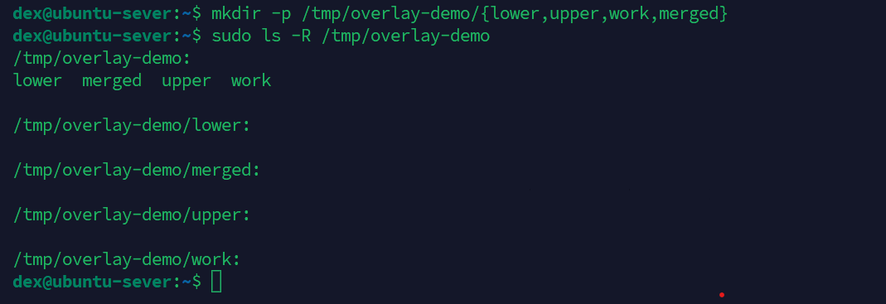
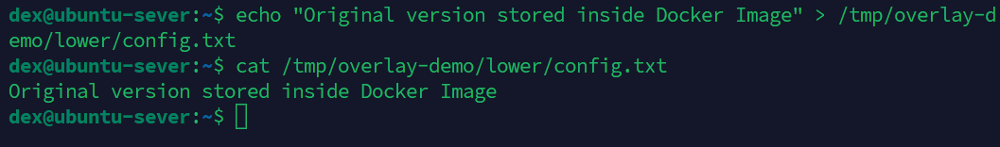
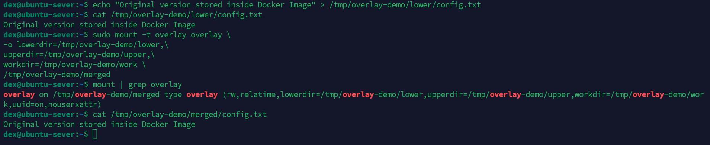
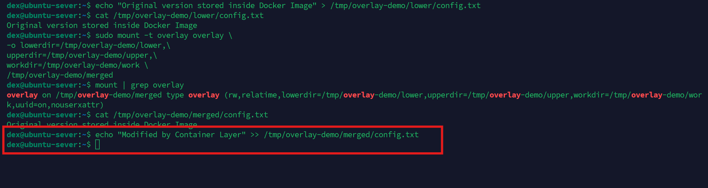

# Lab 02 — Understanding Docker Storage Using Linux OverlayFS

> **Category:** Linux Kernel Internals
>
> **Difficulty:** Beginner → Intermediate
>
> **Estimated Time:** 45–60 minutes
>
> **Environment:** Ubuntu 24.04 LTS, Linux Kernel 6.x

---

# Executive Summary

Docker containers are lightweight because they share image layers instead of creating a complete copy of the filesystem for every container.

This behavior is made possible by **OverlayFS**, a Union Filesystem built into the Linux Kernel.

OverlayFS combines multiple directories into a single unified view while keeping the original image read-only.

When a container modifies a file, the Linux Kernel copies that file into the writable layer before applying any changes.

This mechanism is called **Copy-on-Write (CoW)**.

The objective of this lab is to build an OverlayFS manually without Docker in order to understand how Docker manages container storage internally.

---

# Learning Objectives

After completing this lab, you should be able to:

- Explain how OverlayFS works.
- Describe the purpose of Lower, Upper, Work and Merged directories.
- Understand Copy-on-Write (CoW).
- Explain why Docker Images are read-only.
- Understand why multiple containers can safely share one image.
- Distinguish Docker Images, Container Layers and Docker Volumes.

---

# Background

In the previous lab, we learned that Docker containers are ordinary Linux processes isolated using Linux Namespaces.

This raises another important question.

How can multiple containers created from the same image modify files independently without affecting one another?

The answer is **OverlayFS**.

Instead of copying an entire filesystem, OverlayFS combines multiple directories into a single virtual filesystem.

Each container receives its own writable layer while sharing the original image layers.

This design significantly reduces disk usage and improves container startup performance.

---

# First Principles

Without OverlayFS:

- Every container would require a full copy of the operating system.
- Storage consumption would increase dramatically.
- Container startup would become much slower.

With OverlayFS:

- Docker Images remain read-only.
- Containers only store modified files.
- Multiple containers safely share the same image layers.

---

# OverlayFS Architecture

```

                Container View
                     │
                     ▼

+----------------------------------------+
|               merged                   |
+----------------------------------------+
              ▲
              │
      +-------+--------+
      │                │
      ▼                ▼

+------------+   +---------------+
| upperdir   |   | lowerdir      |
| Read/Write |   | Read Only     |
+------------+   +---------------+
        ▲
        │
        ▼
+------------------+
| workdir          |
| Internal Storage |
+------------------+

```

---

# Lab Workflow

```

Create Directories

↓

Create Original File

↓

Mount OverlayFS

↓

Read File

↓

Modify File

↓

Observe Copy-on-Write

```

---

# Lab Environment

| Component | Version |
|-----------|---------|
| Operating System | Ubuntu 24.04 LTS |
| Linux Kernel | 6.x |
| OverlayFS | overlay2 |
| Docker Engine | Latest Stable |

---

# Step 1 — Create OverlayFS Directories

## Purpose

Create the required directory structure for OverlayFS.

## Command

```bash
mkdir -p /tmp/overlay-demo/{lower,upper,work,merged}
```

## Directory Structure

```

overlay-demo/

├── lower/

├── upper/

├── work/

└── merged/

```

## Observation

At this stage, all directories are empty.

### Screenshot



---

# Step 2 — Create the Original File

## Purpose

Simulate a Docker Image layer.

## Command

```bash
echo "Original version stored inside Docker Image" > /tmp/overlay-demo/lower/config.txt
```

Verify:

```bash
cat /tmp/overlay-demo/lower/config.txt
```

## Observation

The file exists only inside the Lower Layer.

### Screenshot



---

# Step 3 — Mount OverlayFS

## Purpose

Merge the Lower and Upper layers into one virtual filesystem.

## Command

```bash
sudo mount -t overlay overlay \
-o lowerdir=/tmp/overlay-demo/lower,\
upperdir=/tmp/overlay-demo/upper,\
workdir=/tmp/overlay-demo/work \
/tmp/overlay-demo/merged
```

Verify:

```bash
mount | grep overlay
```

## Observation

Linux creates a unified filesystem at the `merged` directory.

### Screenshot


---

# Step 4 — Read the File

## Purpose

Verify that the merged directory exposes files from the lower layer.

## Command

```bash
cat /tmp/overlay-demo/merged/config.txt
```

## Expected Output

```
Original version stored inside Docker Image
```

## Observation

Although the file physically exists only inside `lower`, it becomes visible through the merged directory.

### Screenshot



---

# Step 5 — Modify the File

## Purpose

Trigger the Copy-on-Write mechanism.

## Command

```bash
echo "Modified by Container Layer" >> /tmp/overlay-demo/merged/config.txt
```

## Observation

The modification is performed inside the merged directory.

Linux automatically copies the original file into the writable layer before applying the changes.

### Screenshot



---

# Step 6 — Verify Lower Layer

## Purpose

Confirm that the original image layer remains unchanged.

## Command

```bash
cat /tmp/overlay-demo/lower/config.txt
```

## Observation

The original file remains untouched.

This demonstrates that Docker Images are immutable.

### Screenshot


---

# Step 7 — Verify Upper Layer

## Purpose

Inspect the writable layer created by Copy-on-Write.

## Command

```bash
cat /tmp/overlay-demo/upper/config.txt
```

## Observation

The modified version now exists inside the Upper Layer.

Only this container sees the updated file.

### Screenshot


---

# Technical Analysis

OverlayFS combines multiple directories into one virtual filesystem.

Initially:

- Lower contains the original file.
- Upper is empty.

After modifying the file:

- Lower remains unchanged.
- Linux copies the file into Upper.
- The modified version is stored only in Upper.

This behavior is known as **Copy-on-Write (CoW)**.

Instead of duplicating the entire filesystem, Linux copies only the files that are modified.

This approach significantly reduces storage consumption and improves container startup performance.

---

# Copy-on-Write Workflow

```

Before Modification

Lower
config.txt
│
└── Original Version

Upper
(empty)

Merged
config.txt
│
└── Original Version

────────────────────────────────

After Modification

Lower
config.txt
│
└── Original Version

Upper
config.txt
│
└── Modified Version

Merged
config.txt
│
└── Modified Version

```

---

# Docker Storage Comparison

| Storage Type | Read/Write | Persistent | Managed By |
|--------------|-----------|------------|------------|
| Image Layer | Read Only | Yes | Docker |
| Container Layer | Read/Write | No | Docker |
| Docker Volume | Read/Write | Yes | Docker |
| Bind Mount | Read/Write | Yes | Host OS |

---

# Key Takeaways

- OverlayFS is a Union Filesystem.
- Docker Images are read-only.
- Containers use independent writable layers.
- Copy-on-Write copies only modified files.
- Multiple containers safely share one image.
- OverlayFS improves storage efficiency and container startup speed.

---

# Conclusion

This lab demonstrates how Docker leverages Linux OverlayFS to efficiently manage container storage.

By manually creating an OverlayFS without Docker, we verified that:

- Original image files remain unchanged.
- Modified files are copied into the writable layer.
- Multiple containers can safely share a single image.

Understanding OverlayFS is essential for Docker optimization, troubleshooting storage issues, and designing efficient containerized applications.

---

# Next Lab

**Lab 03 — Understanding Linux cgroups**

Topics:

- CPU Limits
- Memory Limits
- Docker Resource Constraints
- OOM Killer
- Docker Stats

---

# References

- Docker Documentation
- Linux Kernel Documentation
- OverlayFS Documentation
- `man mount`
- `man overlay`
- Open Container Initiative (OCI)
